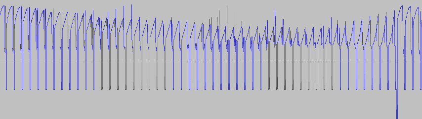

# TVA - Tom's Video-Audio

Converts arbitrary video into a CD-audio compatible file.

I was always fascinated by the idea of sending video through an audio medium,
especially having seen several YouTube videos over the years, from the likes of
[Techmoan](https://www.youtube.com/watch?v=UtNGVb94TFE) and
[The 8-Bit Guy](https://www.youtube.com/watch?v=TCXJ5twf5tM).

The format I've devised here, when you boil it down, is just raw black and white
video at 10 frames per second, for a total bit-rate of 705kbps (ie. mono CD
audio).

## "Spec"

In theory, you can use whatever resolution/frame rate you want (for a trade off
of quality vs performance), as it's stored in a technique almost identical to
typical analogue video.

Each sample contains a greyscale luma brightness for any given pixel, between 0
and 32767 (maximum value for a signed 16-bit integer).

At the end of every line, a horizontal sync pulse with the value _-16384_ should
last for enough time that you can be certain it's there (I've chosen 10
samples). This is based on the assumption that the signal won't be perfectly
digital, and the value was chosen due to it being about half way down the
negative range of signed 16-bit values. After the horizontal sync pulse, the
next line of the frame begins.

Once you have created a frame containing horizontal lines followed by their sync
pulses, you should create a vertical sync pulse in a similar fashion (again,
I've arbitrarily chosen 10 samples), instead using a value as close to _-32768_
as possible, to make sure it's distinct from the horizontal pulse.

Now, you've generated a frame of data! It should look something like this. You
can see each horizontal pulse, followed by a vertical pulse at the end, at which
point a new frame starts.

## Demonstrations

In order to demonstrate what converting the audio file back into a video signal
looks like, I've used a small sample from [NASA's Perseverance Mars landing
parachute deployment](https://www.youtube.com/watch?v=4czjS9h4Fpg) (approx. 10
seconds in - the video on the right-hand side). Of course, our frame size is
very small, in black and white, and only at 10 frames per second, but it looks
something like this:

Next, I thought I'd try converting the encoded audio file to 128k MP3 (and back
to WAV, so it could be decoded), to see what strange artifacts were created. I
was pleasantly surprised to see these results:

You can see the edge of each frame is hindered by the Fourier transform that
happens during the compression process, where each sample fluctuates immediately
after jumping such a large distance.

Finally - what happens if you push it to the extreme and use a very low bit-rate
MP3, specifically 48k. Normally, music sounds really bad at this bit-rate, but
can the format handle it? Now, I was required to make some manual adjustments to
the WAV output, as in a couple of circumstances the horizontal and vertical sync
pulses didn't exactly get down to the correct values, but once resolved the
video looks something like this:

I genuinely think this looks incredible, like an authentic analogue video signal
with sync issues, noise, and everything!

Ironically, the worst the MP3 quality, the larger the GIF created at the end,
due to all the noise.

---

Anyway, I can't imagine this'll ever be of use to anyone, but it was a fun
experiment to run for a few days!
